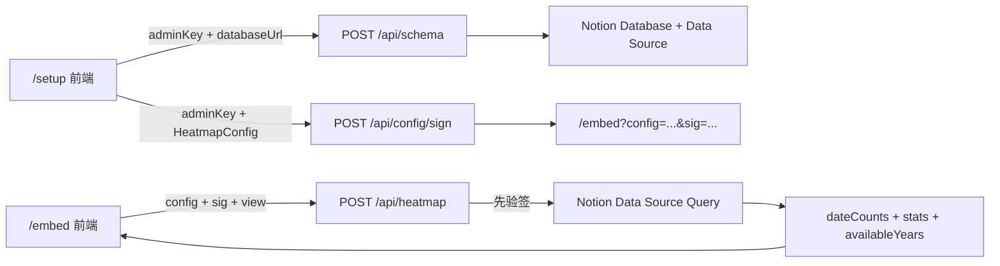

# Notion Heatmap 后端开发参考（已实现）

> 当前可部署和运维步骤请阅读 [部署与运维指南](./deployment.md)。本文件保留为后端实现的逐步技术参考；其中的未完成清单反映编写时的教学顺序，并不代表当前项目状态。

> 本地 Markdown 版本。内容面向只有 JavaScript／TypeScript 语言基础、开发经验为 0 的后端初学者；后续可再同步到 Notion 项目中心。

> 🧭 **适用读者：**只具备 JavaScript／TypeScript 语言基础，第一次开发真实后端项目的人。你不需要先学完所有后端知识；请按本手册顺序，一章一章实现，每完成一章就运行测试并打勾。

## 0. 你最终要完成什么

当前仓库的前端已经可以使用 Mock 数据运行。你的任务不是重新写页面，而是实现三个 Next.js Route Handler，让前端把 `NEXT_PUBLIC_DATA_MODE` 从 `mock` 切换为 `api` 后仍然正常工作：

1. `POST /api/schema`：验证管理员密钥，读取 Notion database 与 data source 的字段结构。
2. `POST /api/config/sign`：验证配置，将配置编码并用 HMAC-SHA256 签名，返回 embed URL。
3. `POST /api/heatmap`：先验证签名，再查询 Notion，按日期聚合并返回热力图数据。

项目的安全底线、API 契约和 MVP 范围来自 [Notion 年度热力图 Widget 需求文档](https://app.notion.com/p/3751d100ccaf8144a569f7ac7f13d1c0) 与 [Notion 年度热力图 Widget 技术设计文档](https://app.notion.com/p/3751d100ccaf817d8c98f9a274b789c5)。学习顺序参考 [项目开始前技术学习路线](https://app.notion.com/p/3771d100ccaf81e48b5ef9c1339526f4)。

### 完成后的请求流程



> 🔒 **永远不能违反的规则：**`NOTION_TOKEN` 和 `CONFIG_SECRET` 只能存在于服务端环境变量。不要放进 React 组件、`NEXT_PUBLIC_` 变量、URL、LocalStorage、API 响应或日志。`/api/heatmap` 必须先验证签名，验证成功后才允许调用 Notion API。

### 动手前的 10 分钟准备

1. 在仓库根目录执行 `npm install`，确认依赖已安装。
2. 将 `.env.example` 复制为 `.env.local`。`.env.local` 已被 `.gitignore` 忽略，不要手动把它加入 Git。
3. 打开 [Notion Integrations](https://www.notion.so/profile/integrations)，创建一个 Internal Integration，把它的 secret 填入 `NOTION_TOKEN`。
4. 打开要统计的 Notion database，在右上角菜单的 Connections／连接中加入刚才的 Integration。只创建 Integration 但不连接 database，API 仍然没有读取权限。
5. 分别生成 `CONFIG_SECRET` 与 `ADMIN_KEY`。可以执行下面命令两次，每次使用不同结果：

```bash
node -e "console.log(require('node:crypto').randomBytes(32).toString('base64url'))"
```

6. 本地开发时保持 `NEXT_PUBLIC_APP_URL=http://localhost:3000` 和 `NEXT_PUBLIC_DATA_MODE=mock`。
7. 运行 `npm run dev`，先确认现有 `/setup` 和 `/embed` 前端能打开，再开始写后端。

> ✅ **准备完成的判断标准：**你已经拥有一个只放在 `.env.local` 的 Integration token、两个不同的随机密钥，以及一个已连接该 Integration 的测试 database。不要在截图、聊天记录、测试代码或 curl 命令中粘贴真实 token。

> 🧪 **版本基线（2026-07-25）：**本手册按仓库当前安装的 Next.js 16.2、TypeScript 6.0 与 `@notionhq/client` 5.23 编写；文中的完整模板已在临时校验工程中通过 TypeScript `strict` typecheck，日期与 streak 核心案例也已实际运行通过。如果以后升级 SDK，先重新检查 database／data source 方法和 query filter 类型。

## 1. 开工前必须理解的 8 个概念

### 1.1 浏览器代码与服务端代码

- React Client Component 会下载到用户浏览器，用户可以查看它。
- `app/api/.../route.ts` 在 Vercel／Node.js 服务端执行，适合读取秘密环境变量。
- 名称以 `NEXT_PUBLIC_` 开头的环境变量会公开给浏览器，所以只能放公开配置。
- 可以在服务端模块顶部写 `import 'server-only';`，避免它被错误导入客户端。

### 1.2 HTTP 请求与响应

前端执行 `fetch('/api/schema', { method: 'POST', body: ... })` 时，会发送一个 HTTP 请求。Route Handler 使用 `await request.json()` 读取 JSON，再用 `NextResponse.json()` 返回 JSON。

常用状态码：

- `200`：成功。
- `400`：输入格式错误。
- `401`：管理员密钥错误。
- `403`：Notion Integration 无权访问资源。
- `404`：database 不存在或不可访问。
- `500`：服务端配置或未知内部错误。
- `504`：外部查询超时。

### 1.3 `async/await` 与 `try/catch`

Notion 请求和读取请求体都是异步操作，必须 `await`。外部 API 可能失败，所以 Route Handler 最外层必须使用 `try/catch`，并把内部错误转换成安全的公开错误。

### 1.4 TypeScript 类型不等于运行时校验

下面的类型只在开发时帮助你，攻击者仍然可以发送任意 JSON：

```typescript
type Body = { adminKey: string };
```

因此 `request.json()` 的结果必须先看作 `unknown`，检查它真的是对象、字段真的是字符串之后，才能使用。

### 1.5 环境变量

`.env.local` 是本机秘密配置，不提交到 Git。后端需要：

```plain text
NOTION_TOKEN=secret_xxx
CONFIG_SECRET=一段足够长的随机字符串
ADMIN_KEY=只有你知道的管理密钥
NEXT_PUBLIC_APP_URL=http://localhost:3000
NEXT_PUBLIC_DATA_MODE=mock
```

后端完成前保留 `mock`；三个 API 全部可用后改成 `api`，并重启 `npm run dev`。

### 1.6 纯函数

只根据参数计算结果、不读网络、不修改外部状态的函数叫纯函数。配置校验、签名、日期范围、聚合、连续天数都应该优先写成纯函数，因为它们最容易测试。

### 1.7 Database 与 Data Source

仓库安装的是 `@notionhq/client` 5.23。当前 SDK 中：

- `notion.databases.retrieve()` 读取 database 容器，并返回 `data_sources`。
- `notion.dataSources.retrieve()` 读取字段 schema。
- `notion.dataSources.query()` 查询页面记录。

> ⚠️ 很多旧教程使用 `notion.databases.query()`。当前项目安装的 SDK 已经没有这个方法，不要照抄旧教程。正确流程是：database ID → retrieve database → 取得第一个 data source ID → retrieve/query data source。

### 1.8 Base64URL 与 HMAC

- Base64URL 是编码，不是加密；任何人都能解码 `config`。
- HMAC-SHA256 使用 `CONFIG_SECRET` 计算签名。
- 用户可以看到 database ID、字段名和筛选条件，但不能伪造修改后的合法签名。
- 修改 `config` 的任意字符都必须导致验签失败。

## 2. 按这个目录实现

当前前端已经存在 `types/`、`lib/api/` 和 `lib/heatmap/`。后端在此基础上增加以下文件，不要创建数据库或 OAuth 模块：

```plain text
app/
  api/
    schema/route.ts
    config/sign/route.ts
    heatmap/route.ts
lib/
  env.ts
  errors.ts
  auth/admin.ts
  config/
    validate.ts
    sign.ts
  notion/
    client.ts
    parseDatabaseId.ts
    resolveDataSource.ts
    schema.ts
    filters.ts
    query.ts
  heatmap/
    dates.ts          # 扩展现有文件，保持前后端可共用
    aggregate.ts
    stats.ts
types/
  config.ts           # 已存在，优先复用
  api.ts              # 已存在，响应必须与它一致
  heatmap.ts          # 已存在，响应必须与它一致
```

### 推荐实现顺序

- [ ] 阶段 A：环境变量、公开错误、管理员密钥。
- [ ] 阶段 B：database ID 解析与 data source 解析。
- [ ] 阶段 C：schema 读取与 `/api/schema`。
- [ ] 阶段 D：配置运行时校验、编码、签名与 `/api/config/sign`。
- [ ] 阶段 E：日期、聚合、统计纯函数。
- [ ] 阶段 F：Notion filter、分页查询与 `/api/heatmap`。
- [ ] 阶段 G：切换真实 API、端到端验证、Vercel 部署。

每个阶段都必须先通过该阶段的测试，再进入下一阶段。不要一次性写完所有文件后才运行。

## 3. 阶段 A：建立安全的服务端基础

### 3.1 集中读取环境变量

新建 `lib/env.ts`：

```typescript
import 'server-only';
import { AppError } from '@/lib/errors';

function requireEnv(name: 'NOTION_TOKEN' | 'CONFIG_SECRET' | 'ADMIN_KEY' | 'NEXT_PUBLIC_APP_URL'): string {
  const value = process.env[name]?.trim();
  if (!value) {
    throw new AppError('ENV_MISSING', 500, 'The server is missing required configuration.');
  }
  return value;
}

export function getServerEnv() {
  return {
    notionToken: requireEnv('NOTION_TOKEN'),
    configSecret: requireEnv('CONFIG_SECRET'),
    adminKey: requireEnv('ADMIN_KEY'),
    appUrl: requireEnv('NEXT_PUBLIC_APP_URL').replace(/\/$/, ''),
  };
}
```

为什么使用函数而不是在模块加载时直接读取：Route 被构建时不一定已经拥有完整的本地环境变量；在请求到达时读取更容易得到清楚的错误。

### 3.2 统一公开错误

新建 `lib/errors.ts`。目的不是“隐藏所有错误”，而是把内部错误映射成前端可以安全显示的格式：

```typescript
import { NextResponse } from 'next/server';

export type AppErrorCode =
  | 'ADMIN_KEY_INVALID'
  | 'ENV_MISSING'
  | 'NOTION_UNAUTHORIZED'
  | 'DATABASE_INVALID'
  | 'DATABASE_NO_DATE_FIELD'
  | 'CONFIG_INVALID'
  | 'CONFIG_SIGNATURE_INVALID'
  | 'NOTION_QUERY_FAILED'
  | 'TIMEOUT';

export class AppError extends Error {
  constructor(
    public readonly code: AppErrorCode,
    public readonly status: number,
    message: string,
  ) {
    super(message);
    this.name = 'AppError';
  }
}

export function errorResponse(error: unknown) {
  if (error instanceof AppError) {
    return NextResponse.json(
      { error: { code: error.code, message: error.message } },
      { status: error.status },
    );
  }

  // 服务端可以记录错误类型，但不要记录 token、完整请求 body 或完整 Notion response。
  console.error('Unhandled server error', error instanceof Error ? error.name : 'UnknownError');
  return NextResponse.json(
    { error: { code: 'NOTION_QUERY_FAILED', message: 'The server could not complete this request.' } },
    { status: 500 },
  );
}
```

### 3.3 安全比较管理员密钥

新建 `lib/auth/admin.ts`：

```typescript
import 'server-only';
import { createHash, timingSafeEqual } from 'node:crypto';
import { getServerEnv } from '@/lib/env';
import { AppError } from '@/lib/errors';

export function safeEqualText(left: string, right: string): boolean {
  const leftDigest = createHash('sha256').update(left).digest();
  const rightDigest = createHash('sha256').update(right).digest();
  return timingSafeEqual(leftDigest, rightDigest);
}

export function assertAdminKey(input: unknown): asserts input is string {
  if (typeof input !== 'string' || !safeEqualText(input, getServerEnv().adminKey)) {
    throw new AppError('ADMIN_KEY_INVALID', 401, 'The admin key is incorrect.');
  }
}
```

### 阶段 A 验收

- [ ] 所有 `process.env` 读取集中在 `lib/env.ts`。
- [ ] 客户端文件中搜不到 `NOTION_TOKEN` 或 `CONFIG_SECRET`。
- [ ] 错误响应总是 `{ error: { code, message } }`。
- [ ] 日志没有完整 token、config、Notion page object。

## 4. 阶段 B：解析 database 并找到 data source

### 4.1 创建 Notion Client

新建 `lib/notion/client.ts`：

```typescript
import 'server-only';
import { Client } from '@notionhq/client';
import { getServerEnv } from '@/lib/env';

export function createNotionClient() {
  return new Client({
    auth: getServerEnv().notionToken,
    timeoutMs: 15_000,
    retry: { maxRetries: 2 },
  });
}
```

不要在文件顶部创建全局 client 并立刻读取环境变量。函数形式更容易测试，也避免构建阶段提前失败。

### 4.2 解析 URL 或 ID

SDK 已提供 `extractDatabaseId()`，可以包一层并统一输出 32 位无连字符 ID。新建 `lib/notion/parseDatabaseId.ts`：

```typescript
import { extractDatabaseId } from '@notionhq/client';
import { AppError } from '@/lib/errors';

export function parseDatabaseId(input: unknown): string {
  if (typeof input !== 'string') {
    throw new AppError('DATABASE_INVALID', 400, 'Enter a valid Notion database URL or ID.');
  }

  const id = extractDatabaseId(input.trim());
  if (!id) {
    throw new AppError('DATABASE_INVALID', 400, 'Enter a valid Notion database URL or ID.');
  }

  return id.replaceAll('-', '').toLowerCase();
}
```

必须测试：

- 32 位纯 ID。
- 带连字符 UUID。
- 完整 Notion URL。
- 带 `?v=...` 的 URL，不能误取 view ID。
- 空字符串、随机文本、长度错误。

### 4.3 从 database 找 data source

新建 `lib/notion/resolveDataSource.ts`：

```typescript
import { APIErrorCode, isFullDatabase, isNotionClientError } from '@notionhq/client';
import type { Client } from '@notionhq/client';
import { AppError } from '@/lib/errors';

export async function resolvePrimaryDataSource(notion: Client, databaseId: string) {
  try {
    const database = await notion.databases.retrieve({ database_id: databaseId });
    if (!isFullDatabase(database) || database.data_sources.length === 0) {
      throw new AppError('DATABASE_INVALID', 400, 'This database has no readable data source.');
    }

    // MVP 前端只配置一个来源；当前选择 database 的第一个 data source。
    return { database, dataSourceId: database.data_sources[0].id };
  } catch (error) {
    if (error instanceof AppError) throw error;
    if (isNotionClientError(error)) {
      if (
        error.code === APIErrorCode.ObjectNotFound ||
        error.code === APIErrorCode.RestrictedResource ||
        error.code === APIErrorCode.Unauthorized
      ) {
        throw new AppError(
          'NOTION_UNAUTHORIZED',
          403,
          'Connect your Notion Integration to this database, then try again.',
        );
      }
    }
    throw new AppError('DATABASE_INVALID', 400, 'The database could not be read.');
  }
}
```

MVP 先选择第一个 data source。未来若支持一个 database 内多个 data source，应把 `dataSourceId` 加入签名配置，而不是在公开 API 接受任意未签名 ID。

### 阶段 B 验收

- [ ] URL 中带 view 参数时仍解析出 database ID。
- [ ] Integration 未连接时返回可行动错误，而不是原始 Notion 错误。
- [ ] 代码使用 `dataSources`，没有使用过时的 `databases.query`。

## 5. 阶段 C：实现 schema 读取与 `/api/schema`

### 5.1 将 Notion schema 缩减成前端契约

前端只需要 `types/api.ts` 中的 `SchemaResponse`，不能返回完整 Notion schema。新建 `lib/notion/schema.ts`：

```typescript
import { isFullDataSource } from '@notionhq/client';
import type { Client, DataSourceObjectResponse } from '@notionhq/client';
import type { FilterProperty, SchemaResponse } from '@/types/api';
import { AppError } from '@/lib/errors';
import { resolvePrimaryDataSource } from './resolveDataSource';

function databaseTitle(title: Array<{ plain_text: string }>): string {
  return title.map((item) => item.plain_text).join('').trim() || 'Untitled database';
}

function filterProperty(
  property: DataSourceObjectResponse['properties'][string],
): FilterProperty | null {
  if (property.type === 'status') {
    return { name: property.name, type: 'status', options: property.status.options.map((item) => item.name) };
  }
  if (property.type === 'select') {
    return { name: property.name, type: 'select', options: property.select.options.map((item) => item.name) };
  }
  if (property.type === 'multi_select') {
    return { name: property.name, type: 'multi_select', options: property.multi_select.options.map((item) => item.name) };
  }
  if (property.type === 'checkbox') {
    return { name: property.name, type: 'checkbox' };
  }
  return null;
}

export async function readDatabaseSchema(notion: Client, databaseId: string): Promise<SchemaResponse> {
  const { database, dataSourceId } = await resolvePrimaryDataSource(notion, databaseId);
  const dataSource = await notion.dataSources.retrieve({ data_source_id: dataSourceId });

  if (!isFullDataSource(dataSource)) {
    throw new AppError('DATABASE_INVALID', 400, 'The data source schema is incomplete.');
  }

  const properties = Object.values(dataSource.properties);
  const dateProperties = properties
    .filter((property) => property.type === 'date')
    .map((property) => ({ name: property.name, type: 'date' as const }));

  const filterProperties = properties
    .map(filterProperty)
    .filter((property): property is FilterProperty => property !== null);

  if (dateProperties.length === 0) {
    throw new AppError('DATABASE_NO_DATE_FIELD', 400, 'This database has no date property.');
  }

  return {
    databaseId,
    databaseName: databaseTitle(database.title),
    dateProperties,
    filterProperties,
  };
}
```

### 5.2 Route Handler

新建 `app/api/schema/route.ts`：

```typescript
import { NextResponse } from 'next/server';
import { assertAdminKey } from '@/lib/auth/admin';
import { errorResponse, AppError } from '@/lib/errors';
import { createNotionClient } from '@/lib/notion/client';
import { parseDatabaseId } from '@/lib/notion/parseDatabaseId';
import { readDatabaseSchema } from '@/lib/notion/schema';

export const runtime = 'nodejs';

function isRecord(value: unknown): value is Record<string, unknown> {
  return typeof value === 'object' && value !== null && !Array.isArray(value);
}

export async function POST(request: Request) {
  try {
    const body: unknown = await request.json();
    if (!isRecord(body)) {
      throw new AppError('DATABASE_INVALID', 400, 'Invalid request body.');
    }

    assertAdminKey(body.adminKey);
    const databaseId = parseDatabaseId(body.databaseUrl);
    const result = await readDatabaseSchema(createNotionClient(), databaseId);
    return NextResponse.json(result);
  } catch (error) {
    return errorResponse(error);
  }
}
```

### 手动验证

启动开发服务器：

```bash
npm run dev
```

再使用另一个终端发送请求：

```bash
curl -X POST http://localhost:3000/api/schema \
  -H 'Content-Type: application/json' \
  -d '{"adminKey":"你的ADMIN_KEY","databaseUrl":"你的Notion数据库URL"}'
```

不要把真实 token 写在 curl body；schema API 只接受 admin key 和 database URL。

### 阶段 C 验收

- [ ] 错误 admin key 返回 `401`。
- [ ] 无效 URL 返回 `400`。
- [ ] 未连接 Integration 返回安全的授权提示。
- [ ] 成功响应与 `types/api.ts` 完全一致。
- [ ] 响应中没有 Notion token、完整 properties 对象或 page 记录。

## 6. 阶段 D：配置校验、编码和签名

### 6.1 运行时校验必须检查什么

新建 `lib/config/validate.ts`。输入类型必须是 `unknown`，通过后才返回 `HeatmapConfig`。MVP 建议锁定以下规则：

- `version` 必须等于 `1`。
- `sources` 必须恰好有一个元素；数组结构保留给未来多数据库。
- `databaseId` 必须是 32 位十六进制，可先去除连字符。
- `dateProperty` 必须是非空字符串。
- `filters` 最多 20 个，type 只能是四种已支持类型。
- checkbox 的 value 必须是 boolean。
- status／select／multi_select 的 value 必须是非空字符串或非空字符串数组。
- `display.mode` 只能是 `rollingYear` 或 `calendarYear`。
- calendarYear 必须带整数 year，建议限制在 1970～2100。
- theme 必须为 `github`。
- timezone 必须能被 `Intl.DateTimeFormat` 接受。

基础辅助函数：

```typescript
import type { HeatmapConfig, SourceFilter } from '@/types/config';
import { AppError } from '@/lib/errors';

function isRecord(value: unknown): value is Record<string, unknown> {
  return typeof value === 'object' && value !== null && !Array.isArray(value);
}

function invalid(message: string): never {
  throw new AppError('CONFIG_INVALID', 400, message);
}

function validTimezone(value: string): boolean {
  try {
    new Intl.DateTimeFormat('en-US', { timeZone: value }).format();
    return true;
  } catch {
    return false;
  }
}

function validateFilter(value: unknown): SourceFilter {
  if (!isRecord(value)) invalid('Invalid filter.');

  const property = typeof value.property === 'string' ? value.property.trim() : '';
  if (!property) invalid('Filter property is required.');

  if (value.type === 'checkbox') {
    if (typeof value.value !== 'boolean') invalid('Checkbox filter must be boolean.');
    return { property, type: 'checkbox', value: value.value };
  }

  if (value.type !== 'status' && value.type !== 'select' && value.type !== 'multi_select') {
    invalid('Unsupported filter type.');
  }

  if (typeof value.value === 'string') {
    const normalized = value.value.trim();
    if (!normalized) invalid('Filter values cannot be empty.');
    return { property, type: value.type, value: normalized };
  }

  if (Array.isArray(value.value)) {
    const normalized = value.value.map((item) =>
      typeof item === 'string' ? item.trim() : '',
    );
    if (normalized.length === 0 || normalized.some((item) => !item)) {
      invalid('Filter values cannot be empty.');
    }
    return { property, type: value.type, value: normalized };
  }

  return invalid('Filter values cannot be empty.');
}
```

接着完成 `validateConfig(input)`：

```typescript
export function validateConfig(input: unknown): HeatmapConfig {
  if (!isRecord(input) || input.version !== 1) invalid('Unsupported config version.');
  if (!Array.isArray(input.sources) || input.sources.length !== 1) {
    invalid('MVP requires exactly one source.');
  }

  const rawSource = input.sources[0];
  if (!isRecord(rawSource)) invalid('Invalid source.');

  const databaseId =
    typeof rawSource.databaseId === 'string'
      ? rawSource.databaseId.replaceAll('-', '').toLowerCase()
      : '';
  if (!/^[0-9a-f]{32}$/.test(databaseId)) invalid('Invalid database ID.');
  if (typeof rawSource.dateProperty !== 'string' || !rawSource.dateProperty.trim()) {
    invalid('Date property is required.');
  }
  if (!Array.isArray(rawSource.filters) || rawSource.filters.length > 20) {
    invalid('Invalid filters.');
  }

  const databaseUrl = rawSource.databaseUrl;
  const databaseName = rawSource.databaseName;
  if (databaseUrl !== undefined && typeof databaseUrl !== 'string') invalid('Invalid database URL.');
  if (databaseName !== undefined && typeof databaseName !== 'string') invalid('Invalid database name.');

  if (!isRecord(input.display)) invalid('Display configuration is required.');
  const mode = input.display.mode;
  if (mode !== 'rollingYear' && mode !== 'calendarYear') invalid('Invalid display mode.');
  if (input.display.theme !== 'github') invalid('Unsupported theme.');

  let year: number | undefined;
  if (mode === 'calendarYear') {
    if (
      !Number.isInteger(input.display.year) ||
      Number(input.display.year) < 1970 ||
      Number(input.display.year) > 2100
    ) {
      invalid('Calendar year is invalid.');
    }
    year = Number(input.display.year);
  }

  if (typeof input.timezone !== 'string' || !validTimezone(input.timezone)) {
    invalid('Timezone is invalid.');
  }

  return {
    version: 1,
    sources: [{
      databaseId,
      ...(databaseUrl ? { databaseUrl } : {}),
      ...(databaseName ? { databaseName } : {}),
      dateProperty: rawSource.dateProperty.trim(),
      filters: rawSource.filters.map(validateFilter),
    }],
    display: {
      mode,
      ...(year === undefined ? {} : { year }),
      theme: 'github',
    },
    timezone: input.timezone,
  };
}
```

不要直接写 `return input as HeatmapConfig`，因为 `as` 只是在告诉 TypeScript“相信我”，不会验证任何东西。

### 6.2 编码与签名

新建 `lib/config/sign.ts`：

```typescript
import 'server-only';
import { createHmac } from 'node:crypto';
import { safeEqualText } from '@/lib/auth/admin';
import { getServerEnv } from '@/lib/env';
import { AppError } from '@/lib/errors';
import type { HeatmapConfig } from '@/types/config';
import { validateConfig } from './validate';

const MAX_ENCODED_CONFIG_LENGTH = 16_384;

export function encodeConfig(config: HeatmapConfig): string {
  return Buffer.from(JSON.stringify(config), 'utf8').toString('base64url');
}

export function signEncodedConfig(encodedConfig: string): string {
  return createHmac('sha256', getServerEnv().configSecret)
    .update(encodedConfig, 'utf8')
    .digest('base64url');
}

export function verifyEncodedConfig(encodedConfig: string, signature: string): boolean {
  return safeEqualText(signEncodedConfig(encodedConfig), signature);
}

export function decodeAndValidateConfig(encodedConfig: string): HeatmapConfig {
  if (!encodedConfig || encodedConfig.length > MAX_ENCODED_CONFIG_LENGTH) {
    throw new AppError('CONFIG_INVALID', 400, 'The configuration is invalid.');
  }
  try {
    const json = Buffer.from(encodedConfig, 'base64url').toString('utf8');
    return validateConfig(JSON.parse(json) as unknown);
  } catch (error) {
    if (error instanceof AppError) throw error;
    throw new AppError('CONFIG_INVALID', 400, 'The configuration is invalid.');
  }
}
```

### 6.3 签名 Route

`app/api/config/sign/route.ts` 的顺序必须是：读取 body → 验证 admin key → 运行时校验 config → 编码 → 签名 → 拼接 URL。

```typescript
import { NextResponse } from 'next/server';
import { assertAdminKey } from '@/lib/auth/admin';
import { encodeConfig, signEncodedConfig } from '@/lib/config/sign';
import { validateConfig } from '@/lib/config/validate';
import { getServerEnv } from '@/lib/env';
import { AppError, errorResponse } from '@/lib/errors';

export const runtime = 'nodejs';

function isRecord(value: unknown): value is Record<string, unknown> {
  return typeof value === 'object' && value !== null && !Array.isArray(value);
}

export async function POST(request: Request) {
  try {
    const body: unknown = await request.json();
    if (!isRecord(body)) throw new AppError('CONFIG_INVALID', 400, 'Invalid request body.');
    assertAdminKey(body.adminKey);

    const config = validateConfig(body.config);
    const encoded = encodeConfig(config);
    const sig = signEncodedConfig(encoded);
    const embedUrl = `${getServerEnv().appUrl}/embed?config=${encoded}&sig=${sig}`;
    return NextResponse.json({ embedUrl });
  } catch (error) {
    return errorResponse(error);
  }
}
```

### 阶段 D 必测用例

- [ ] Unicode 字段名编码后可以正确解码。
- [ ] 同一 config 和 secret 总是得到同一签名。
- [ ] 修改 config 一个字符后验签失败。
- [ ] 修改 signature 一个字符后验签失败。
- [ ] 错误 version、空 sources、错误 filter value、非法 timezone 全部被拒绝。
- [ ] `CONFIG_SECRET` 修改后旧链接失效。

## 7. 阶段 E：日期、聚合与统计

这一阶段先不要调用 Notion。只写纯函数和测试。

### 7.1 日期 key 与时区

项目统一使用 `YYYY-MM-DD`。Notion date 如果只有日期，直接使用；如果含时间，按配置 timezone 转换。先把下面函数加入现有 `lib/heatmap/dates.ts`：

```typescript
export function toDateKeyInTimezone(value: string, timezone: string): string {
  if (/^\d{4}-\d{2}-\d{2}$/.test(value)) return value;

  const date = new Date(value);
  if (Number.isNaN(date.getTime())) throw new Error('Invalid date');

  const parts = new Intl.DateTimeFormat('en-CA', {
    timeZone: timezone,
    year: 'numeric',
    month: '2-digit',
    day: '2-digit',
  }).formatToParts(date);

  const map = Object.fromEntries(parts.map((part) => [part.type, part.value]));
  return `${map.year}-${map.month}-${map.day}`;
}
```

测试必须包含跨日案例，例如 UTC 的 `2026-01-01T00:30:00Z` 在不同时区可能对应不同日期。

### 7.2 日期范围

- `calendarYear`：`YYYY-01-01` 到 `YYYY-12-31`。
- `rollingYear`：以配置时区的今天为 end，向前覆盖 365／366 个日历日。
- 为避免闰年时产生 367 个格子，本手册采用“去年同日后一天”为 start。

例：今天为 2026-07-25，rolling range 为 2025-07-26 到 2026-07-25。

不要使用毫秒除法直接推算年份；应把 `YYYY-MM-DD` 当作 UTC 日历日期做加减。

仓库的 `lib/heatmap/dates.ts` 已经有 `parseDateKey()`、`toDateKey()` 和 `enumerateDateKeys()`，不要再声明同名函数。保留现有代码，并在同一文件中加入下面三个导出函数：

```typescript
import type { HeatmapView } from '@/types/config';

export function addDays(key: string, amount: number): string {
  const date = parseDateKey(key);
  date.setUTCDate(date.getUTCDate() + amount);
  return toDateKey(date);
}

function addYearsClamped(key: string, amount: number): string {
  const date = parseDateKey(key);
  const targetYear = date.getUTCFullYear() + amount;
  const month = date.getUTCMonth();
  const lastDay = new Date(Date.UTC(targetYear, month + 1, 0)).getUTCDate();
  return toDateKey(new Date(Date.UTC(targetYear, month, Math.min(date.getUTCDate(), lastDay))));
}

export function todayInTimezone(timezone: string, now = new Date()): string {
  return toDateKeyInTimezone(now.toISOString(), timezone);
}

export function getHeatmapRange(
  view: HeatmapView,
  timezone: string,
  now = new Date(),
): HeatmapRange {
  const today = todayInTimezone(timezone, now);
  if (view.mode === 'calendarYear') {
    const year = view.year;
    if (!Number.isInteger(year)) throw new Error('Calendar year is required');
    return { start: `${year}-01-01`, end: `${year}-12-31` };
  }

  return { start: addDays(addYearsClamped(today, -1), 1), end: today };
}
```

上面代码直接复用文件中已经存在的 `parseDateKey()` 与 `toDateKey()`。现有 `enumerateDateKeys()` 也继续保留；它已经会按天生成包含首尾日期的完整 key 列表。

### 7.3 聚合 Notion page

```typescript
import type { PageObjectResponse } from '@notionhq/client';
import { toDateKeyInTimezone } from './dates';

export function aggregatePages(
  pages: PageObjectResponse[],
  dateProperty: string,
  timezone: string,
): Record<string, number> {
  const counts: Record<string, number> = {};

  for (const page of pages) {
    const property = page.properties[dateProperty];
    if (!property || property.type !== 'date' || !property.date?.start) continue;

    const key = toDateKeyInTimezone(property.date.start, timezone);
    counts[key] = (counts[key] ?? 0) + 1;
  }

  return counts;
}
```

日期范围只使用 Notion date range 的 `start`，忽略 `end`。

### 7.4 统计规则

- `total`：当前返回范围内所有 count 之和。
- `activeDays`：count 大于 0 的日期数量。
- `longestStreak`：范围内最长连续活跃天数。
- `currentStreak`：从 `min(range.end, today)` 向前连续活跃的天数。
- 当前年份的未来日期不能进入 total、activeDays 或 streak。

正确算法必须遍历范围内的每一天，而不是只遍历有数据的 key，否则中间缺失日期不会中断 streak。

```typescript
import type { HeatmapRange, HeatmapStats } from '@/types/heatmap';
import { addDays, enumerateDateKeys } from './dates';

export function countsForRange(
  allCounts: Record<string, number>,
  range: HeatmapRange,
  today: string,
): Record<string, number> {
  return Object.fromEntries(
    Object.entries(allCounts).filter(
      ([date]) => date >= range.start && date <= range.end && date <= today,
    ),
  );
}

export function availableYears(allCounts: Record<string, number>): number[] {
  return [...new Set(Object.keys(allCounts).map((date) => Number(date.slice(0, 4))))]
    .filter(Number.isInteger)
    .sort((left, right) => right - left);
}

export function calculateStats(
  range: HeatmapRange,
  counts: Record<string, number>,
  today: string,
): HeatmapStats {
  const effectiveEnd = range.end < today ? range.end : today;
  const dates = enumerateDateKeys({ start: range.start, end: effectiveEnd });
  let total = 0;
  let activeDays = 0;
  let longestStreak = 0;
  let runningStreak = 0;

  for (const date of dates) {
    const count = counts[date] ?? 0;
    total += count;
    if (count > 0) {
      activeDays += 1;
      runningStreak += 1;
      longestStreak = Math.max(longestStreak, runningStreak);
    } else {
      runningStreak = 0;
    }
  }

  let currentStreak = 0;
  for (let cursor = effectiveEnd; cursor >= range.start; cursor = addDays(cursor, -1)) {
    if ((counts[cursor] ?? 0) === 0) break;
    currentStreak += 1;
  }

  return { total, activeDays, longestStreak, currentStreak };
}
```

### 阶段 E 必测用例

- [ ] 2024 年生成 366 天。
- [ ] 缺失日期仍会中断 streak。
- [ ] date range 使用 start。
- [ ] 含时间日期按 Asia/Taipei 正确转换。
- [ ] 同一天多条记录正确累加。
- [ ] 当前年份未来记录被忽略。
- [ ] 空数据返回四项统计都为 0。

## 8. 阶段 F：构建筛选、分页查询和 `/api/heatmap`

### 8.1 筛选语义

前端已经确定：不同 filter 条件之间是 AND；同一 status／select／multi_select 条件中的多个值是 OR。当前 SDK 允许筛选值使用字符串数组。

新建 `lib/notion/filters.ts`：

```typescript
import type { QueryDataSourceParameters } from '@notionhq/client';
import { AppError } from '@/lib/errors';
import type { HeatmapSource } from '@/types/config';

type NotionFilter = NonNullable<QueryDataSourceParameters['filter']>;
type AndItem = Extract<NotionFilter, { and: unknown }>['and'][number];

export function buildSourceFilter(source: HeatmapSource): NotionFilter {
  const and: AndItem[] = [
    { property: source.dateProperty, date: { is_not_empty: true } },
  ];

  for (const filter of source.filters) {
    if (filter.type === 'checkbox') {
      if (typeof filter.value !== 'boolean') {
        throw new AppError('CONFIG_INVALID', 400, 'Checkbox filter must be boolean.');
      }
      and.push({ property: filter.property, checkbox: { equals: filter.value } });
      continue;
    }

    if (typeof filter.value !== 'string' && !Array.isArray(filter.value)) {
      throw new AppError('CONFIG_INVALID', 400, 'Filter values are invalid.');
    }

    if (filter.type === 'multi_select') {
      and.push({ property: filter.property, multi_select: { contains: filter.value } });
    } else if (filter.type === 'select') {
      and.push({ property: filter.property, select: { equals: filter.value } });
    } else if (filter.type === 'status') {
      and.push({ property: filter.property, status: { equals: filter.value } });
    } else {
      throw new AppError('CONFIG_INVALID', 400, 'Unsupported filter type.');
    }
  }

  return { and };
}
```

SDK 5.23 的 `equals`／`contains` 接受一个字符串或字符串数组；数组表示“命中其中任意值”，正好对应前端的 OR 语义。即使 config 已经通过校验，这里仍保留类型防御，避免以后有人绕过 `validateConfig()` 直接调用这个函数。

### 8.2 必须处理分页

新建 `lib/notion/query.ts`：

```typescript
import { isFullPage } from '@notionhq/client';
import type { Client, PageObjectResponse, QueryDataSourceParameters } from '@notionhq/client';
import { AppError } from '@/lib/errors';

type QueryClient = {
  dataSources: Pick<Client['dataSources'], 'query'>;
};

export async function queryAllPages(
  notion: QueryClient,
  args: Omit<QueryDataSourceParameters, 'start_cursor' | 'page_size' | 'result_type'>,
): Promise<PageObjectResponse[]> {
  const pages: PageObjectResponse[] = [];
  let cursor: string | undefined;

  do {
    const response = await notion.dataSources.query({
      ...args,
      start_cursor: cursor,
      page_size: 100,
      result_type: 'page',
    });

    for (const result of response.results) {
      if (isFullPage(result)) pages.push(result);
    }

    if (response.request_status?.type === 'incomplete') {
      throw new AppError('NOTION_QUERY_FAILED', 502, 'The Notion query returned incomplete data.');
    }

    cursor = response.has_more ? response.next_cursor ?? undefined : undefined;
  } while (cursor);

  return pages;
}
```

如果只查询一次，超过 100 条的记录会丢失，这是本项目必须测试的回归风险。

### 8.3 availableYears 与性能取舍

产品要求年份选项来自实际数据。MVP 最容易理解且准确的方案是：

1. 使用 source filters 查询所有含有效日期的匹配记录。
2. 聚合成完整 `allDateCounts`。
3. 从所有 date key 得到去重、倒序的 `availableYears`。
4. 根据本次 view range 截取 `dateCounts`。
5. 对截取后的数据计算 stats。

这是个人自部署 MVP 的明确取舍：实现简单、年份准确，但大 database 会读取较多记录。Route 会先读取 data source schema，取得日期字段的 property ID，再用 `filter_properties: [dateProperty.id]` 只请求日期属性，降低 payload。`filter_properties` 要传 property ID，不要想当然地传字段名。未来再把年份扫描独立缓存；MVP 不引入 Vercel KV。

### 8.4 `/api/heatmap` 的安全顺序

顺序不能交换：

1. 读取 body 并确认 config、sig 是字符串。
2. **先验证签名。**
3. 验签成功后才解码、运行时校验 config。
4. 验证 view。
5. 从签名 config 取得 databaseId；不要接受另一个公开 database URL。
6. resolve data source。
7. 查询、聚合、截取范围、计算年份和 stats。
8. 只返回前端契约。

新建 `app/api/heatmap/route.ts`。下面是可直接实现的完整 Route；先读一遍注释，再逐段输入，不要跳过长度限制与验签顺序：

```typescript
import { isFullDataSource } from '@notionhq/client';
import { NextResponse } from 'next/server';
import { decodeAndValidateConfig, verifyEncodedConfig } from '@/lib/config/sign';
import { AppError, errorResponse } from '@/lib/errors';
import { aggregatePages } from '@/lib/heatmap/aggregate';
import {
  availableYears,
  calculateStats,
  countsForRange,
} from '@/lib/heatmap/stats';
import { getHeatmapRange, todayInTimezone } from '@/lib/heatmap/dates';
import { createNotionClient } from '@/lib/notion/client';
import { buildSourceFilter } from '@/lib/notion/filters';
import { queryAllPages } from '@/lib/notion/query';
import { resolvePrimaryDataSource } from '@/lib/notion/resolveDataSource';
import type { HeatmapConfig, HeatmapView } from '@/types/config';

export const runtime = 'nodejs';

const MAX_CONFIG_LENGTH = 16_384;
const MAX_SIGNATURE_LENGTH = 256;

function isRecord(value: unknown): value is Record<string, unknown> {
  return typeof value === 'object' && value !== null && !Array.isArray(value);
}

function invalidSignature(): never {
  throw new AppError(
    'CONFIG_SIGNATURE_INVALID',
    401,
    'This embed link is invalid. Generate a new one from setup.',
  );
}

function validateView(
  input: unknown,
  fallback: HeatmapConfig['display'],
): HeatmapView {
  const candidate = input === undefined ? fallback : input;
  if (!isRecord(candidate)) {
    throw new AppError('CONFIG_INVALID', 400, 'The requested view is invalid.');
  }

  if (candidate.mode === 'rollingYear') {
    return { mode: 'rollingYear', year: null };
  }

  if (
    candidate.mode === 'calendarYear' &&
    Number.isInteger(candidate.year) &&
    Number(candidate.year) >= 1970 &&
    Number(candidate.year) <= 2100
  ) {
    return { mode: 'calendarYear', year: Number(candidate.year) };
  }

  throw new AppError('CONFIG_INVALID', 400, 'The requested view is invalid.');
}

export async function POST(request: Request) {
  try {
    const body: unknown = await request.json();
    if (
      !isRecord(body) ||
      typeof body.config !== 'string' ||
      body.config.length === 0 ||
      body.config.length > MAX_CONFIG_LENGTH ||
      typeof body.sig !== 'string' ||
      body.sig.length === 0 ||
      body.sig.length > MAX_SIGNATURE_LENGTH
    ) {
      invalidSignature();
    }

    // 安全边界：这行之前不能创建 Notion client，更不能调用 Notion。
    if (!verifyEncodedConfig(body.config, body.sig)) invalidSignature();

    const config = decodeAndValidateConfig(body.config);
    const view = validateView(body.view, config.display);
    const source = config.sources[0];

    const notion = createNotionClient();
    const { dataSourceId } = await resolvePrimaryDataSource(notion, source.databaseId);
    const dataSource = await notion.dataSources.retrieve({ data_source_id: dataSourceId });

    if (!isFullDataSource(dataSource)) {
      throw new AppError('DATABASE_INVALID', 400, 'The data source schema is incomplete.');
    }

    const dateProperty = dataSource.properties[source.dateProperty];
    if (!dateProperty || dateProperty.type !== 'date') {
      throw new AppError(
        'DATABASE_NO_DATE_FIELD',
        400,
        'The configured date property no longer exists.',
      );
    }

    const pages = await queryAllPages(notion, {
      data_source_id: dataSourceId,
      filter: buildSourceFilter(source),
      filter_properties: [dateProperty.id],
    });

    const allDateCounts = aggregatePages(pages, source.dateProperty, config.timezone);
    const today = todayInTimezone(config.timezone);
    const range = getHeatmapRange(view, config.timezone);
    const dateCounts = countsForRange(allDateCounts, range, today);
    const stats = calculateStats(range, dateCounts, today);

    return NextResponse.json({
      range,
      availableYears: availableYears(allDateCounts),
      dateCounts,
      stats,
    });
  } catch (error) {
    return errorResponse(error);
  }
}
```

注意 `filter_properties` 使用的是刚从 schema 读取到的 `dateProperty.id`。配置里保存的是字段名，供 filter 与 page aggregation 使用；查询参数为了精确裁剪返回字段而使用 property ID。

### `/api/heatmap` 返回值

必须精确匹配当前 `types/heatmap.ts`：

```json
{
  "range": { "start": "2025-07-26", "end": "2026-07-25" },
  "availableYears": [2026, 2025, 2024],
  "dateCounts": { "2026-07-25": 3 },
  "stats": {
    "total": 30,
    "activeDays": 12,
    "longestStreak": 5,
    "currentStreak": 2
  }
}
```

绝对不能返回：完整 page、页面标题列表、property object、token、内部 stack trace。

### 阶段 F 验收

- [ ] 签名错误时 Notion client 一次都没有被调用。
- [ ] 250 条模拟记录会请求 3 页并全部聚合。
- [ ] 不同 filter 用 AND，同一 filter 多值用 OR。
- [ ] `availableYears` 去重且倒序。
- [ ] 当前范围之外的 count 不进入返回 `dateCounts` 和 stats。
- [ ] Notion 返回 incomplete 时不静默返回缺失数据。

## 9. 如何写测试：新手可执行版本

项目已配置 Vitest。测试文件放在被测文件旁边，例如 `lib/config/sign.test.ts`。

### 9.1 Arrange、Act、Assert

每个测试按三步读：

```typescript
it('rejects a tampered config', () => {
  // Arrange：准备合法数据
  const encoded = encodeConfig(validConfig);
  const signature = signEncodedConfig(encoded);

  // Act：篡改数据
  const tampered = `${encoded}x`;

  // Assert：结果必须失败
  expect(verifyEncodedConfig(tampered, signature)).toBe(false);
});
```

### 9.2 不要在单元测试请求真实 Notion

真实 API 慢、不稳定、需要秘密 token。把 Notion client 作为函数参数传入，然后提供假的 query 函数：

```typescript
const fakeNotion = {
  dataSources: {
    query: vi
      .fn()
      .mockResolvedValueOnce({ results: first100, has_more: true, next_cursor: 'page-2' })
      .mockResolvedValueOnce({ results: next100, has_more: true, next_cursor: 'page-3' })
      .mockResolvedValueOnce({ results: last50, has_more: false, next_cursor: null }),
  },
};
```

必要时让 `queryAllPages` 接受一个只包含 query 方法的较小接口，而不是强制伪造完整 `Client`。

### 9.3 后端完成前必须有的测试清单

- [ ] `parseDatabaseId.test.ts`：五类输入。
- [ ] `validate.test.ts`：合法配置与每个主要非法分支。
- [ ] `sign.test.ts`：Unicode、篡改、secret 变化、Base64URL。
- [ ] `dates.test.ts`：闰年、rolling range、timezone 跨日。
- [ ] `aggregate.test.ts`：空日期、date range start、同日累加。
- [ ] `stats.test.ts`：缺口、范围边界、未来日期、空数据。
- [ ] `filters.test.ts`：四种 filter 与 AND／OR 语义。
- [ ] `query.test.ts`：多页、空页、incomplete、Notion error。
- [ ] Route tests：错误 admin、错误签名、安全错误格式、成功响应格式。

每一轮使用：

```bash
npm run typecheck
npm run lint
npm test
npm run build
```

“浏览器看起来能用”不能替代测试；尤其签名、时区和分页错误很难只靠肉眼发现。

## 10. 前后端接线步骤

### 10.1 保持 Mock 开发

先保持：

```plain text
NEXT_PUBLIC_DATA_MODE=mock
```

分别用 curl 或 Route test 完成三个 API。这样后端错误不会妨碍查看前端。

### 10.2 切换真实 API

三个 API 都通过后，将 `.env.local` 改成：

```plain text
NEXT_PUBLIC_DATA_MODE=api
```

完全停止并重新执行 `npm run dev`。Next.js 不会自动把所有环境变量变化应用到已运行进程。

### 10.3 端到端流程

1. 在 Notion 创建测试 database，至少包含 Date、Status、Tags、Completed 四类属性。
2. 在 database 的连接设置中加入你的 Integration。
3. 打开 `/setup`，输入 admin key 和 database URL。
4. 确认 schema 显示 database 名称与字段选项。
5. 选择日期字段和多个 filter，点击 Preview。
6. 生成 embed URL，打开它。
7. 切换年份、刷新并对照 Notion 中的记录数量。
8. 手动修改 URL 中 config 一个字符，确认 `/embed` 显示 invalid link，并确认服务端没有发起 Notion query。
9. 增加超过 100 条测试记录或使用分页 mock，确认不会漏数据。

## 11. 常见错误排查

| 现象 | 最可能原因 | 检查方法 |
| --- | --- | --- |
| 前端一直显示 Demo Data | `NEXT_PUBLIC_DATA_MODE` 仍为 mock | 改成 api，并完全重启开发服务器 |
| `notion.databases.query is not a function` | 复制了旧版 SDK 教程 | 改用 `dataSources.query`，先由 database 取得 data source ID |
| database object_not_found | Integration 未连接、URL 错误或取成 view ID | 重新连接 Integration，并测试 `parseDatabaseId` |
| 只显示前 100 条 | 没有循环 `has_more` | 为 250 条 mock 写分页测试 |
| 日期前后偏移一天 | 直接用服务器本地时区或错误解析 date-only | date-only 原样保留；datetime 使用配置 timezone |
| 签名总是不匹配 | 签名了 JSON 而验证 encoded string，或使用普通 Base64 | 签名和验证都必须针对同一个 Base64URL 字符串 |
| 改了 env 但行为没变 | 开发服务器仍使用旧环境 | 停止进程再执行 `npm run dev` |
| TypeScript 通过但恶意 JSON 导致崩溃 | 把请求体直接 `as HeatmapConfig` | 所有外部输入从 unknown 开始做运行时校验 |
| Vercel 成功部署但 API 500 | Vercel 未配置环境变量 | 检查 Production 环境四个变量并重新部署 |

## 12. Vercel 部署与安全检查

1. 在 Vercel Project Settings → Environment Variables 添加四个必需变量。
2. `NEXT_PUBLIC_APP_URL` 使用最终 HTTPS 域名，不要保留 localhost。
3. Production 的 `NEXT_PUBLIC_DATA_MODE` 设为 `api`。
4. 重新部署后先测试 `/api/schema`，再生成新的 embed URL。
5. 修改 `CONFIG_SECRET` 会使所有旧 embed URL 失效，这是预期行为。
6. 不要在 Vercel logs 输出 request body 或 Notion response。
7. 不要把 `.env.local`、token 或生成后的秘密配置提交到 Git。

### 部署前命令门禁

```bash
npm run typecheck
npm run lint
npm test
npm run build
npm audit --omit=dev
```

## 13. 最终完成审计

### 功能

- [ ] `/api/schema` 能处理 URL、ID、schema 和无日期字段。
- [ ] `/api/config/sign` 返回前端可直接打开的 embed URL。
- [ ] `/api/heatmap` 支持 rollingYear 与 calendarYear。
- [ ] 四种筛选类型工作正确。
- [ ] `availableYears` 来自实际匹配数据并倒序。
- [ ] total、activeDays、longestStreak、currentStreak 与手工计算一致。

### 安全

- [ ] Token 没有出现在客户端 bundle、URL、LocalStorage、响应和日志。
- [ ] 错误 admin key 不能读取 schema 或生成签名。
- [ ] 未签名或被篡改 config 不能触发 Notion query。
- [ ] 签名使用 HMAC-SHA256 和 constant-time comparison。
- [ ] 所有 request body 都从 `unknown` 开始校验。
- [ ] 公开错误不包含原始 Notion response 或 stack trace。

### 数据正确性

- [ ] 分页不会漏掉 100 条后的数据。
- [ ] date range 使用 start 日期。
- [ ] datetime 按配置 timezone 转换。
- [ ] 缺失日期能正确中断 streak。
- [ ] 当前年份未来日期不计数。
- [ ] 返回前端的只有聚合数据。

### 工程质量

- [ ] Route 只做编排，复杂逻辑在 `lib/` 纯函数或服务模块。
- [ ] 环境变量集中读取。
- [ ] 高风险逻辑都有测试。
- [ ] typecheck、lint、test、build 全部通过。
- [ ] 真实 Notion database 完成一次端到端验证。

## 14. 现在从哪里开始

第一次实践只做下面四件事，不要马上调用 Notion：

1. 创建 `lib/env.ts`。
2. 创建 `lib/errors.ts`。
3. 创建 `lib/auth/admin.ts` 和测试。
4. 运行 `npm run typecheck`、`npm run lint`、`npm test`。

通过后再进入 database ID 解析。每次只解决一个小问题，这比一次写完整后端更快，也更容易知道错误发生在哪里。

## Sources

- [Notion 年度热力图 Widget 需求文档](https://app.notion.com/p/3751d100ccaf8144a569f7ac7f13d1c0)
- [Notion 年度热力图 Widget 技术设计文档](https://app.notion.com/p/3751d100ccaf817d8c98f9a274b789c5)
- [项目开始前技术学习路线：HTML/CSS 到 Notion Heatmap MVP](https://app.notion.com/p/3771d100ccaf81e48b5ef9c1339526f4)
